# 🚀 Jenkins + GitHub CI/CD Pipeline – Java Calculator Project

## 📋 Project Requirement

> **Build a Java Calculator project and automate its CI/CD pipeline using Jenkins and GitHub.**

### Java Files Required

**`Calculator.java`** — Contains the following methods:
- `add(int a, int b)`
- `sub(int a, int b)`
- `mul(int a, int b)`
- `div(int a, int b)`

**`CalculatorMain.java`** — Contains the `main()` method to invoke all calculator operations.

### Objectives
- ✅ Both programs must be pushed to GitHub
- ✅ As soon as code is pushed → Jenkins must **compile and execute** automatically
- ✅ As soon as code is pushed → Jenkins must **compile, test, build, and execute** automatically

---

## ✅ STEP 1: Create Your Java Project Structure

Create a folder with the following structure:

```
CalculatorProject/
│
├── Calculator.java
└── CalculatorMain.java
```

### 🔹 Calculator.java

```java
public class Calculator {

    public int add(int a, int b) {
        return a + b;
    }

    public int sub(int a, int b) {
        return a - b;
    }

    public int mul(int a, int b) {
        return a * b;
    }

    public int div(int a, int b) {
        return a / b;
    }
}
```

### 🔹 CalculatorMain.java

```java
public class CalculatorMain {
    public static void main(String[] args) {

        Calculator c = new Calculator();

        System.out.println("Addition: "       + c.add(10, 5));
        System.out.println("Subtraction: "    + c.sub(10, 5));
        System.out.println("Multiplication: " + c.mul(10, 5));
        System.out.println("Division: "       + c.div(10, 5));
    }
}
```
---

## ✅ STEP 2: Push Code to GitHub

### 1️⃣ Create a Repository on GitHub
- Go to [GitHub](https://github.com)
- Click **New Repository**
- Name it: `CalculatorProject`
- Click **Create Repository**

### 2️⃣ Push from Your Local Machine

Open CMD inside your project folder and run:

```bash
git init
git add .
git commit -m "Initial commit - Calculator project"
git branch -M main
git remote add origin https://github.com/yourusername/CalculatorProject.git
git push -u origin main
```

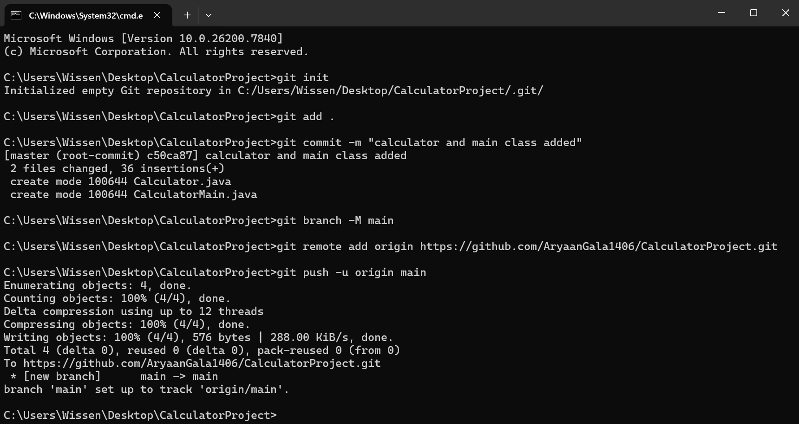
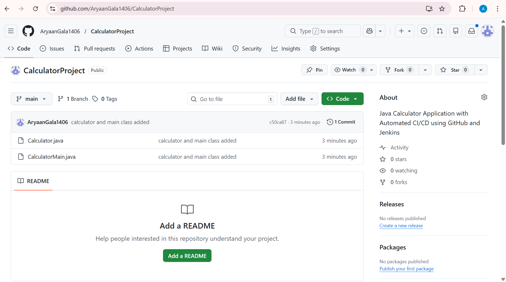
---

## ✅ STEP 3: Install Required Jenkins Plugins

Navigate to:
```
Manage Jenkins → Plugins
```

Install the following plugins:
- **Git Plugin**
- **GitHub Plugin**
- **GitHub Integration Plugin**
- **Maven Integration Plugin** *(optional but recommended)*

Restart Jenkins after installation.

---

## ✅ STEP 4: Create a Jenkins Job

Navigate to:
```
New Item → Enter Name → CalculatorJob → Freestyle Project → OK
```

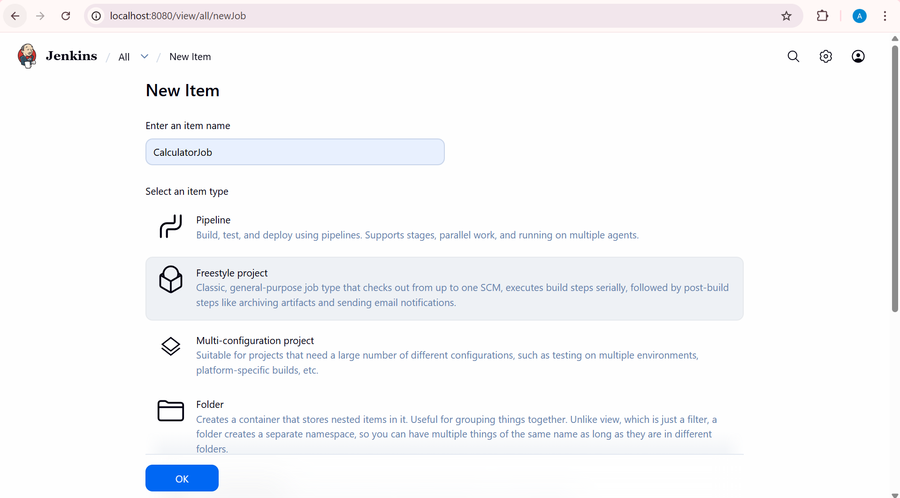
---

## ✅ STEP 5: Connect Jenkins to GitHub Repository

Inside the Job configuration:

**Source Code Management → Select Git**
- **Repository URL:** Paste your GitHub repo URL
- If the repo is private → Add credentials
- If you have changed your branch while pushing the code → Change branch name

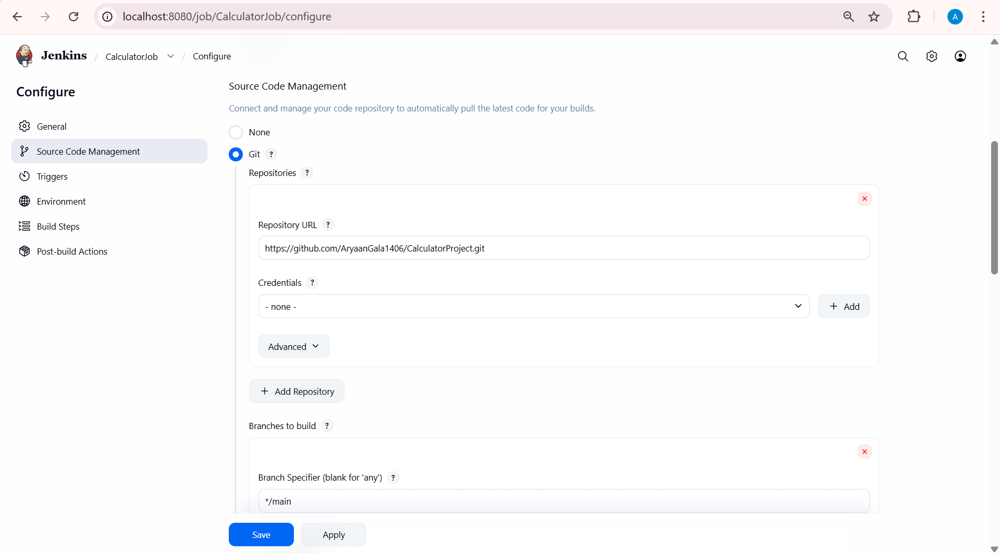

---

## ✅ STEP 6: Configure GitHub Webhook Trigger

Inside the Job configuration:

**Build Triggers → ✔ Select:**
```
GitHub hook trigger for GITScm polling
```

Save the job.

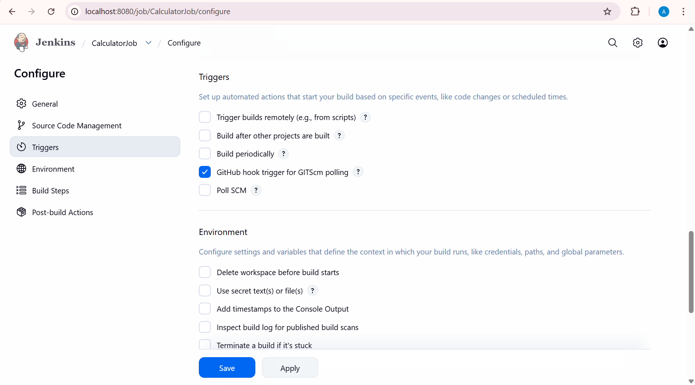

---

## ✅ STEP 7: Add Build Steps (Compile & Run)

Inside Job → **Build Section → Add Build Step → Execute Windows Batch Command**

Add the following commands:

```batch
javac Calculator.java CalculatorMain.java
java CalculatorMain
```

Save the job.

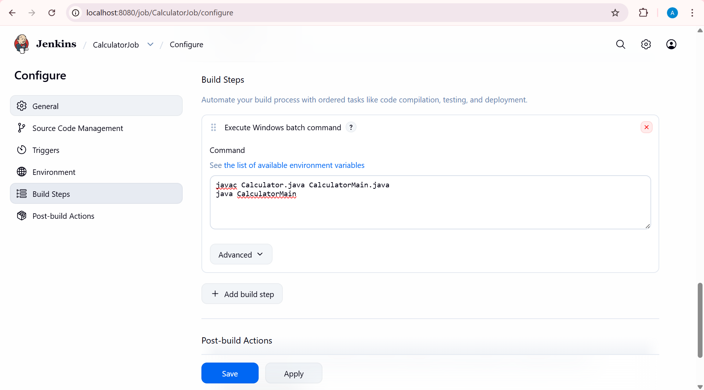
---

## ✅ STEP 8: Configure GitHub Webhook

Go to:
```
GitHub → Your Repo → Settings → Webhooks → Add Webhook
```

**Payload URL:**
```
http://YOUR_IP:8080/github-webhook/
```

> ⚠️ **If Jenkins is running locally, GitHub cannot reach it directly.**
> Use **ngrok** to expose your local Jenkins to the internet.

### Using ngrok (Easiest for Beginners)

1. Download [ngrok](https://ngrok.com)
2. Run:
```bash
ngrok http 8080
```
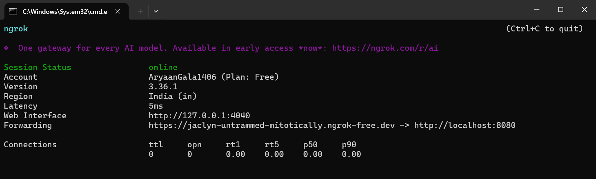

3. ngrok will give you a public URL like:
```
https://abcd1234.ngrok.io
```
4. Use this as your Payload URL:
```
https://abcd1234.ngrok.io/github-webhook/
```
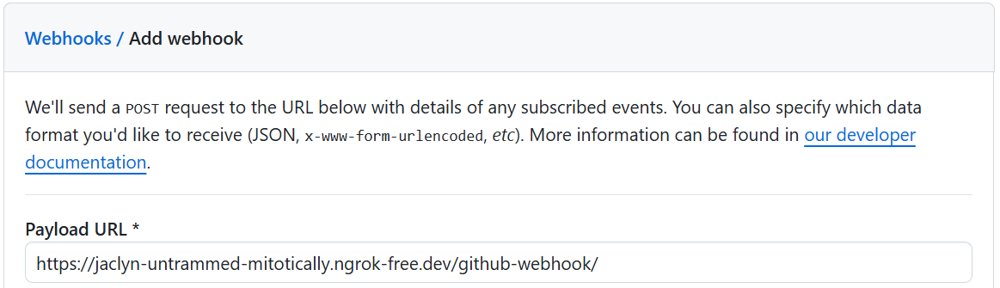

**Webhook Settings:**
| Field | Value |
|-------|-------|
| Content Type | `application/json` |
| Events | `Just the push event` |

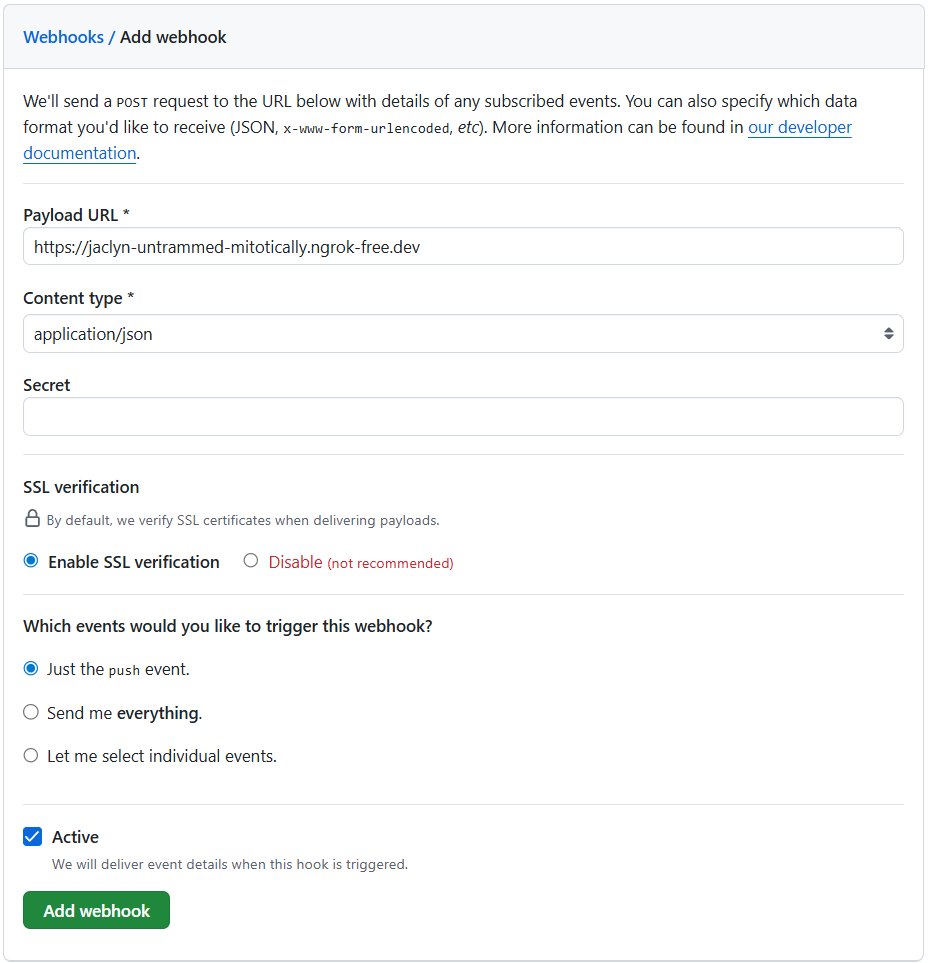

Click **Add Webhook**.

---

## ✅ STEP 9: Test the Pipeline

1. Make a small change in `Calculator.java`
2. Commit and push:

```bash
git add .
git commit -m "Testing webhook"
git push
```

Jenkins will **immediately**:
- Pull the latest code
- Compile the project
- Execute the program
- Show output in the console

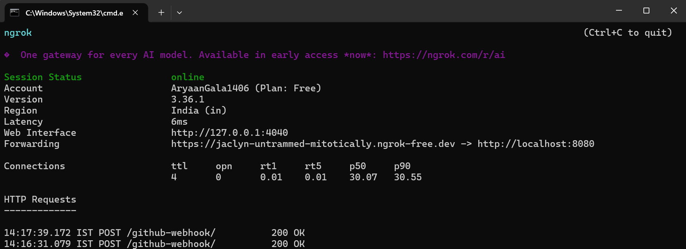
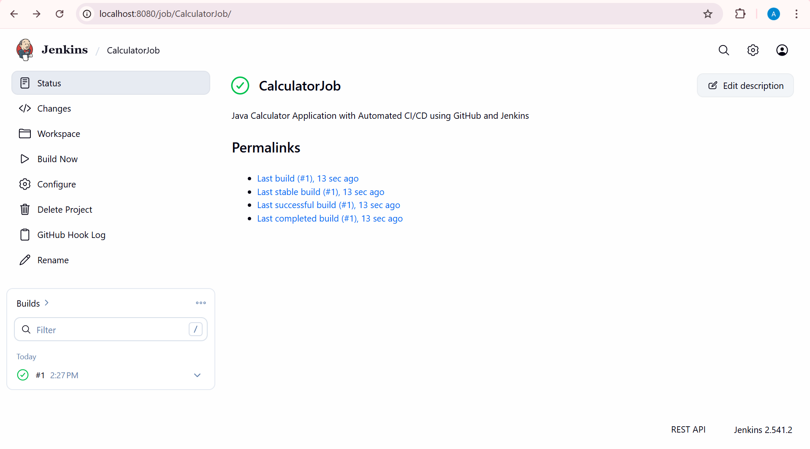
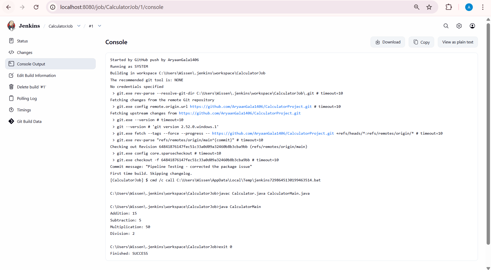

---

## 🔥 Advanced: Full CI Pipeline (Compile + Test + Build)

For a more complete pipeline, convert the project to a **Maven** structure:

```
CalculatorProject/
│
├── pom.xml
└── src
    └── main
        └── java
            ├── Calculator.java
            └── CalculatorMain.java
```

### Jenkins Build Step (Maven)

Instead of the batch command, choose:
```
Invoke top-level Maven targets
```

Goals:
```
clean compile test package
```

Jenkins will now automatically:
1. **Clean** previous builds
2. **Compile** the source code
3. **Run tests**
4. **Build** a JAR file
5. **Execute** the program

### 📸 Screenshot – Maven Setup
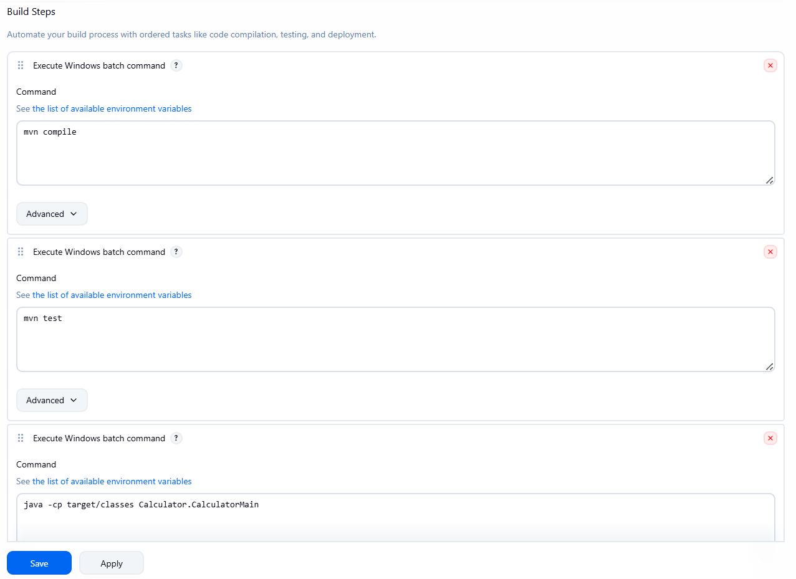
```
Started by GitHub push by AryaanGala1406
Running as SYSTEM
Building in workspace C:\Users\Wissen\.jenkins\workspace\CalculatorJob
The recommended git tool is: NONE
No credentials specified
 > git.exe rev-parse --resolve-git-dir C:\Users\Wissen\.jenkins\workspace\CalculatorJob\.git # timeout=10
Fetching changes from the remote Git repository
 > git.exe config remote.origin.url https://github.com/AryaanGala1406/CalculatorProject.git # timeout=10
Fetching upstream changes from https://github.com/AryaanGala1406/CalculatorProject.git
 > git.exe --version # timeout=10
 > git --version # 'git version 2.52.0.windows.1'
 > git.exe fetch --tags --force --progress -- https://github.com/AryaanGala1406/CalculatorProject.git +refs/heads/*:refs/remotes/origin/* # timeout=10
 > git.exe rev-parse "refs/remotes/origin/main^{commit}" # timeout=10
Checking out Revision d7e9642644ecad1128ea9e355fa7adaced6736fd (refs/remotes/origin/main)
 > git.exe config core.sparsecheckout # timeout=10
 > git.exe checkout -f d7e9642644ecad1128ea9e355fa7adaced6736fd # timeout=10
Commit message: "Maven Pipeline Testing - added commands on different lines"
 > git.exe rev-list --no-walk d47c3bad9c0673be273c620ae3450cf3cccb915d # timeout=10
[CalculatorJob] $ cmd /c call C:\Users\Wissen\AppData\Local\Temp\jenkins4621642244431014350.bat

C:\Users\Wissen\.jenkins\workspace\CalculatorJob>mvn compile 
[INFO] Scanning for projects...
[INFO] 
[INFO] -----------------------< com.example:calculator >-----------------------
[INFO] Building calculator 1.0
[INFO]   from pom.xml
[INFO] --------------------------------[ jar ]---------------------------------
[INFO] 
[INFO] --- resources:3.3.1:resources (default-resources) @ calculator ---
[INFO] skip non existing resourceDirectory C:\Users\Wissen\.jenkins\workspace\CalculatorJob\src\main\resources
[INFO] 
[INFO] --- compiler:3.13.0:compile (default-compile) @ calculator ---
[INFO] Recompiling the module because of changed source code.
[INFO] Compiling 2 source files with javac [debug target 17] to target\classes
[INFO] ------------------------------------------------------------------------
[INFO] BUILD SUCCESS
[INFO] ------------------------------------------------------------------------
[INFO] Total time:  1.128 s
[INFO] Finished at: 2026-02-25T16:09:44+05:30
[INFO] ------------------------------------------------------------------------
[CalculatorJob] $ cmd /c call C:\Users\Wissen\AppData\Local\Temp\jenkins10992598957042902505.bat

C:\Users\Wissen\.jenkins\workspace\CalculatorJob>mvn test 
[INFO] Scanning for projects...
[INFO] 
[INFO] -----------------------< com.example:calculator >-----------------------
[INFO] Building calculator 1.0
[INFO]   from pom.xml
[INFO] --------------------------------[ jar ]---------------------------------
[INFO] 
[INFO] --- resources:3.3.1:resources (default-resources) @ calculator ---
[INFO] skip non existing resourceDirectory C:\Users\Wissen\.jenkins\workspace\CalculatorJob\src\main\resources
[INFO] 
[INFO] --- compiler:3.13.0:compile (default-compile) @ calculator ---
[INFO] Nothing to compile - all classes are up to date.
[INFO] 
[INFO] --- resources:3.3.1:testResources (default-testResources) @ calculator ---
[INFO] skip non existing resourceDirectory C:\Users\Wissen\.jenkins\workspace\CalculatorJob\src\test\resources
[INFO] 
[INFO] --- compiler:3.13.0:testCompile (default-testCompile) @ calculator ---
[INFO] Recompiling the module because of changed source code.
[INFO] Compiling 1 source file with javac [debug target 17] to target\test-classes
[INFO] 
[INFO] --- surefire:3.2.5:test (default-test) @ calculator ---
[INFO] Using auto detected provider org.apache.maven.surefire.junitplatform.JUnitPlatformProvider
[INFO] 
[INFO] -------------------------------------------------------
[INFO]  T E S T S
[INFO] -------------------------------------------------------
[INFO] Running Calculator.CalculatorTest
[INFO] Tests run: 2, Failures: 0, Errors: 0, Skipped: 0, Time elapsed: 0.053 s -- in Calculator.CalculatorTest
[INFO] 
[INFO] Results:
[INFO] 
[INFO] Tests run: 2, Failures: 0, Errors: 0, Skipped: 0
[INFO] 
[INFO] ------------------------------------------------------------------------
[INFO] BUILD SUCCESS
[INFO] ------------------------------------------------------------------------
[INFO] Total time:  2.764 s
[INFO] Finished at: 2026-02-25T16:09:49+05:30
[INFO] ------------------------------------------------------------------------
[CalculatorJob] $ cmd /c call C:\Users\Wissen\AppData\Local\Temp\jenkins3010221519481346065.bat

C:\Users\Wissen\.jenkins\workspace\CalculatorJob>java -cp target/classes Calculator.CalculatorMain 
Addition: 15
Subtraction: 5
Multiplication: 50
Division: 2

C:\Users\Wissen\.jenkins\workspace\CalculatorJob>exit 0 
Finished: SUCCESS
```
---

## 🔄 Complete CI/CD Flow

```
Push Code → GitHub Webhook → Jenkins Triggered → Pull Latest Code
    → Compile → Test → Build → Execute → Console Output
```

This is called: ✅ **Continuous Integration (CI)**

---

## 🧠 Architecture Overview

```
Developer → Git Push → GitHub → Webhook → Jenkins → Build → Run
```

---

## 🚀 What You Have Achieved

By completing this project, you have built:

| Achievement | Description |
|-------------|-------------|
| ✅ Automated CI Pipeline | Code push triggers automatic build |
| ✅ Webhook-based Trigger | Real-time trigger via GitHub Webhooks |
| ✅ Real-time Compilation | Java code compiled on every push |
| ✅ Real-time Execution | Program executes automatically |

> 💡 **This is exactly how real companies run their DevOps pipelines.**

---

## 🛠️ Prerequisites

- Windows OS
- Java JDK installed
- Git installed
- Jenkins running via `java -jar jenkins.war`
- GitHub account

---

## 📂 Repository Structure

```
CalculatorProject/
│
├── Calculator.java         # Calculator logic
├── CalculatorMain.java     # Main entry point
└── README.md               # This file
```
